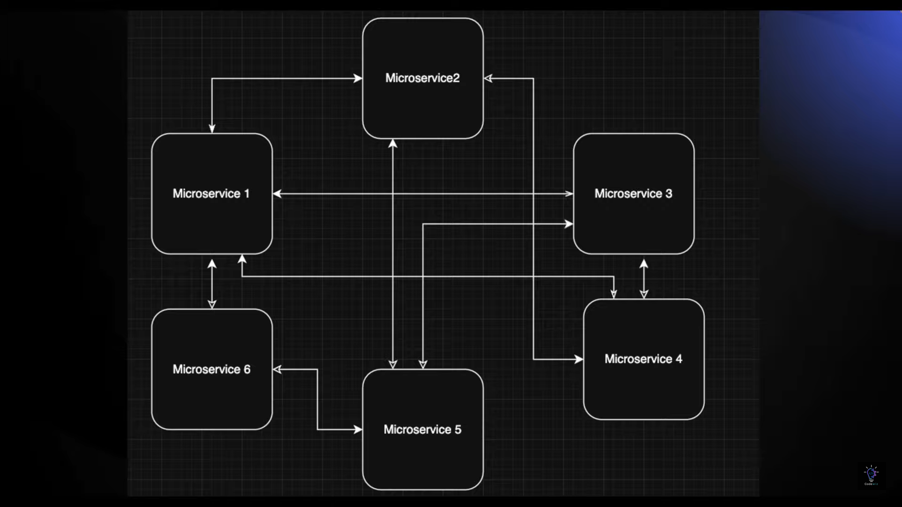
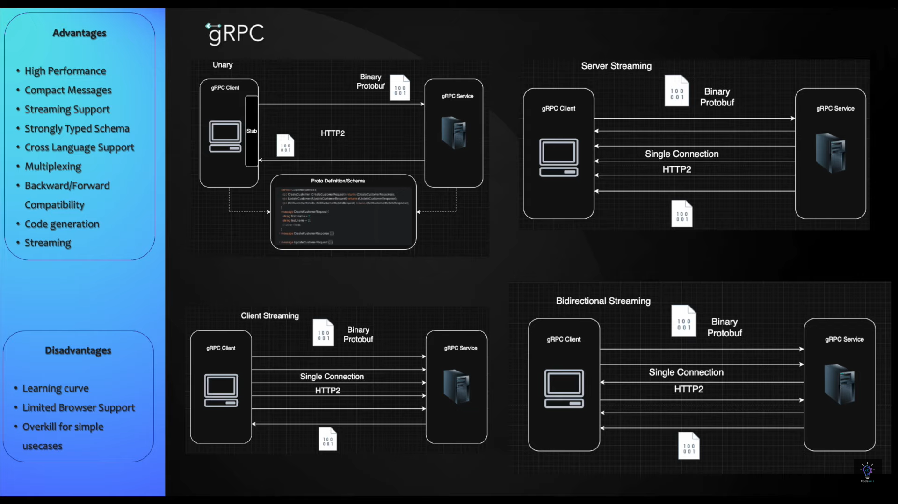
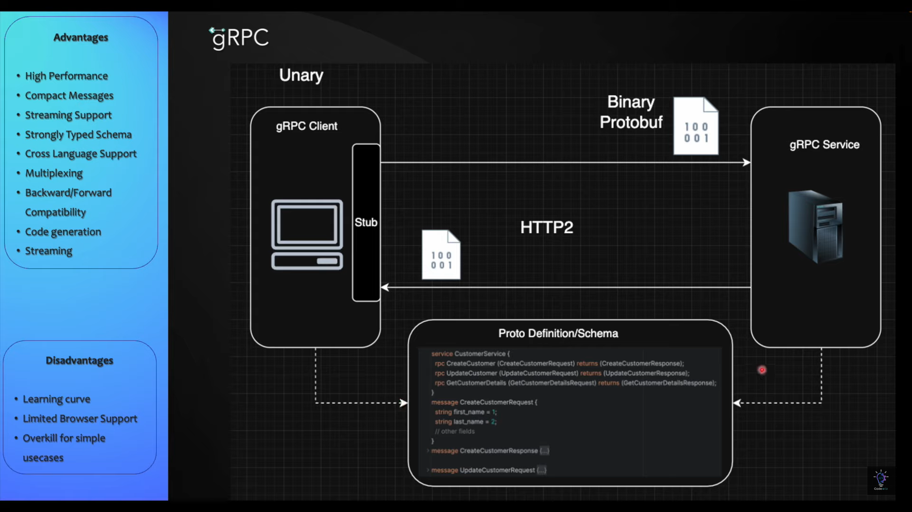

# Healthcare gRPC Microservices
**GitHub Repository**: [healthcare-grpcMicroservices](https://github.com/SAMKE-glitch/healthcare-grpcMicorservices)  


---

## **Overview**

This project demonstrates a **high-performance microservices architecture** for a healthcare system, built using **gRPC**, **Java 21**, and **Spring Boot**. The design promotes efficient, type-safe, low-latency communication between distributed services through the use of Protocol Buffers and HTTP/2 transport. Additionally, it leverages industry-standard tools such as **PostgreSQL** (containerized via **Docker**) for data persistence and **Maven** for multi-module project management and code generation.

### **Architectural Overview**
The following diagram illustrates the overall microservices architecture, emphasizing the inter-service communication and the integration of various system components:



---

## **Key Features**

- **RPC Communication Patterns**:
  - **Unary RPCs**: Demonstrates efficient single-request single-response interactions, e.g., patient registration.
  - **Server Streaming RPCs**: Enables real-time appointment availability updates by streaming data from server to client.
  - **Bidirectional Streaming RPCs**: Supports interactive communication such as doctor-patient chat, where both parties can continuously send and receive messages.

- **Strong API Contracts**: All interfaces are defined using `.proto` files to enforce consistency and compatibility across services.

- **Scalability & Resilience**: The system leverages stateless microservices and containerized databases, ensuring it can scale horizontally and maintain high availability.

### **gRPC Type Definitions**
The project includes well-defined gRPC types to ensure robust service contracts. The image below provides a visual representation of the available gRPC types and their relationships:



### **Unary RPC Implementation**
A specific example of a Unary RPC call is showcased for patient registration. This streamlined request-response interaction is pivotal for ensuring low-latency communication:



---
---

## 1. Prerequisites
- **Java 21+** (OpenJDK or Oracle JDK).
- **Maven 3.8+** (Build tool).
- **Docker & Docker Compose** (For PostgreSQL and pgAdmin).
- **gRPC Tools**:
    - **grpcurl** (CLI testing): [Installation Guide](https://github.com/fullstorydev/grpcurl)
    - **grpcui** (Web UI): [Installation Guide](https://github.com/fullstorydev/grpcui)
    - **postman** 
---

---
## 2. Project Setup
### Clone the Repository
```bash  
git clone https://github.com/SAMKE-glitch/healthcare-grpcMicorservices.git  
cd healthcare-grpcMicorservices 

### Project Structure
```bash 
healthcare-grpcMicorservices/  
├── common-proto/          # Shared Protocol Buffers definitions  
├── patient-service/       # Patient registration and management  
├── doctor-service/        # Doctor data management  
├── appointment-service/   # Appointment booking and streaming  
└── compose.yml     # PostgreSQL and pgAdmin setup  
```
---

---
## 3. Build the Project
### Generate Protobuf Code:
        ```bash
        cd common-proto  
        mvn clean install       # Generates Java classes from .proto files  
        ```

### Build All Modules:
        ```
        cd ..  
        mvn clean install       # Builds patient, doctor, and appointment services  
        ```
---

## 4. Database Setup

### 1. Start PostgreSQL and pgAdmin:
    ```
    docker-compose up -d    # Launches PostgreSQL (port 5432) and pgAdmin (port 8081)  
    ```

### 2. Access pgAdmin:
Open http://localhost:8081/browser/ in your browser.

Login with admin@example.com / password:admin.

Connect to PostgreSQL:
    - Host: postgres (Docker service name)
    
    - Port: 5432
    
    - Database: healthcare-app-db
    
    - Username/Password: admin / admin
---
## 5. Run the Services
Run all the 3 services for testing.

Refer to this [Schema.sql](https://github.com/SAMKE-glitch/healthcare-grpcMicorservices/blob/main/schema.sql) to create Tables on your databases
Refer to this [file](https://github.com/SAMKE-glitch/healthcare-grpcMicorservices/blob/main/TestingWalkThrough.md) when running queries either on your grpcurl for CLI Testing, or POSTMAN, and grpcui for WebUI Testing,